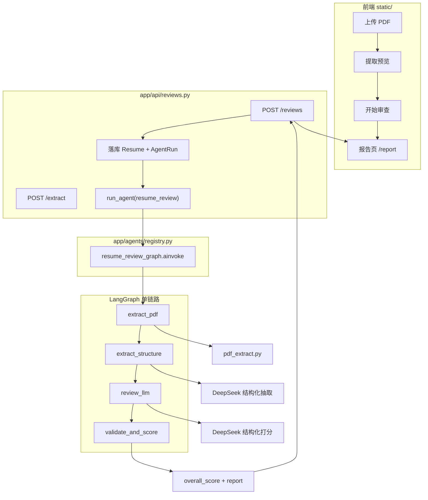
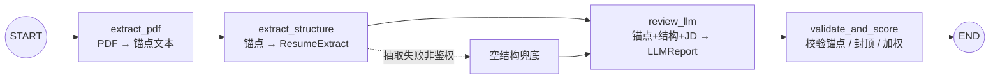

# Agent 1：简历审查单链路智能体

本文档说明项目中 **`resume_review`** 单链路 Agent 的目录结构、端到端逻辑、流程图与关键代码。对应版本以当前仓库实现为准（V1.1 及之后的父子块切分、结构化提示词等改动）。

---

## 1. 目标与边界

| 项 | 说明 |
|----|------|
| Agent Key | `resume_review` |
| 形态 | **单链路 LangGraph**：4 个节点顺序执行，无分支、无多 Agent 协作 |
| 输入 | PDF 字节 + 可选岗位名 / JD |
| 输出 | 六维评分报告 + 整体评价 + 后端加权综合分 |
| 模型 | DeepSeek（默认 `deepseek-v4-flash`），经 `ChatOpenAI` 兼容接口调用 |
| 不做 | OCR（仅文本型 PDF）、异步队列、多轮对话审阅 |

扩展方式：在 `app/agents/registry.py` 注册新 `agent_key`，审查 API 仍通过 `run_agent(key, payload)` 调度。

---

## 2. 项目结构（与本 Agent 相关）

```text
Resume-cursor/
├── web_run.py                 # 启动入口（默认 8001，占用则回退 8002–8005）
├── app/
│   ├── main.py                # FastAPI 应用：路由挂载、静态页、生命周期
│   ├── api/
│   │   └── reviews.py         # 审查 API：预览 / 创建 / 列表 / 详情 / 删除
│   ├── agents/
│   │   ├── registry.py        # Agent 注册表：resume_review → LangGraph
│   │   └── resume_review/
│   │       ├── graph.py       # 编译后的图实例
│   │       ├── nodes.py       # 状态、四节点、建图、结构化 LLM 调用
│   │       ├── prompts.py     # 抽取 / 审查系统提示与用户提示构造
│   │       └── schemas.py     # ResumeExtract、LLMReport、权重与综合分
│   ├── services/
│   │   └── pdf_extract.py     # PDF 坐标提取 + 父子块锚点
│   ├── core/                  # config、JWT、权限依赖
│   ├── models/                # Resume、AgentRun、User、Tenant…
│   └── schemas/review.py      # HTTP 层响应模型
└── static/                    # 前端：上传预览、审查、历史、报告页
```

**数据落库（审查一次）：**

- `resumes`：文件名、提取文本、磁盘路径  
- `agent_runs`：`agent_key=resume_review`、状态、输入 JSON、输出 JSON（含 `overall_score` / `weights` / `report`）

---

## 3. 端到端逻辑

### 3.1 用户侧

1. 登录（企业管理员 / 成员；平台管理员不能访问简历审查）  
2. 上传 PDF → `POST /api/reviews/extract` 预览带锚点文本  
3. 确认后「开始审查」→ `POST /api/reviews`（multipart）  
4. 接口返回成功后跳转 `/report` 展示结果；历史页可查看 / 删除  

### 3.2 服务侧（创建审查）

1. 校验 PDF（类型、非空、≤ 8MB）  
2. 写入 `uploads/{tenant_id}/{user_id}/{uuid}.pdf`  
3. 创建 `Resume` + `AgentRun(status=running)`  
4. `run_agent("resume_review", {pdf_bytes, job_title, job_description})`  
5. 成功：回写 `extracted_text`、`output_json`、`status=succeeded`  
6. 失败：`status=failed`，HTTP 400 + 错误信息  

### 3.3 权限与隔离

- 审查接口依赖 `require_tenant_user`  
- 列表 / 删除按租户过滤；**成员**仅看自己的 `AgentRun`，**企业管理员**看本企业全部  

---

## 4. 流程图

### 4.1 系统总览



### 4.2 Agent 四节点详图



### 4.3 状态字段流转

| 阶段 | `ReviewState` 主要字段 |
|------|------------------------|
| 入图 | `pdf_bytes`, `job_title?`, `job_description?` |
| extract_pdf 后 | + `anchored_text` |
| extract_structure 后 | + `structured_resume` |
| review_llm 后 | + `llm_report` |
| validate_and_score 后 | 更新 `llm_report`，+ `overall_score`, `weights` |

---

## 5. 关键代码说明

### 5.1 注册与调度

`app/agents/registry.py` 把 key 映射到可调用 runner；审查 API 只依赖注册表，不直接 import 图细节。

```python
# 注册
register("resume_review", _run_resume_review)

async def _run_resume_review(payload: dict[str, Any]) -> dict[str, Any]:
    return await resume_review_graph.ainvoke(payload)

async def run_agent(agent_key: str, payload: dict[str, Any]) -> dict[str, Any]:
    runner = _REGISTRY.get(agent_key)
    if runner is None:
        raise KeyError(f"未知 Agent：{agent_key}")
    return await runner(payload)
```

图实例在 `app/agents/resume_review/graph.py`：

```python
from app.agents.resume_review.nodes import build_resume_review_graph

resume_review_graph = build_resume_review_graph()
```

### 5.2 建图（单链路边）

```189:202:app/agents/resume_review/nodes.py
def build_resume_review_graph(checkpointer: Any | None = None):
    graph = StateGraph(ReviewState)
    graph.add_node("extract_pdf", extract_pdf)
    graph.add_node("extract_structure", extract_structure)
    graph.add_node("review_llm", review_llm)
    graph.add_node("validate_and_score", validate_and_score)
    graph.add_edge(START, "extract_pdf")
    graph.add_edge("extract_pdf", "extract_structure")
    graph.add_edge("extract_structure", "review_llm")
    graph.add_edge("review_llm", "validate_and_score")
    graph.add_edge("validate_and_score", END)
    ...
```

### 5.3 节点一：`extract_pdf`

把 PDF 交给 `extract_anchored_text`（线程池，避免阻塞事件循环），产出带方括号锚点的纯文本。

```104:106:app/agents/resume_review/nodes.py
async def extract_pdf(state: ReviewState) -> dict[str, Any]:
    anchored = await asyncio.to_thread(extract_anchored_text, state["pdf_bytes"])
    return {"anchored_text": anchored}
```

**PDF 服务要点（`pdf_extract.py`）：**

1. `pypdf` 按页 visitor 取文字坐标，必要时双栏：先左栏后右栏。  
2. 识别章节标题 → **父块**（如 `工作经历`、`项目经历`、`专业技能`）；未识别落入 `正文`。  
3. 父块内按标点 / 空白切 **子块**，输出形如：

```text
## 项目经历
[项目经历-1] 选课系统
[项目经历-2] 负责后端接口开发
[项目经历-3] Spring Boot
```

审查时 `evidence` 只允许填锚点 ID（如 `项目经历-2`），不能填正文。

### 5.4 节点二：`extract_structure`

用 `EXTRACT_PROMPT` + 锚点文本，结构化输出 `ResumeExtract`。非鉴权失败时用空结构继续，避免整次审查因抽取中断。

```109:124:app/agents/resume_review/nodes.py
async def extract_structure(state: ReviewState) -> dict[str, Any]:
    ...
    try:
        extracted = await _ainvoke_structured(llm, ResumeExtract, messages)
        return {"structured_resume": _dump_model(extracted, ResumeExtract)}
    except (AuthenticationError, PermissionDeniedError) as exc:
        raise RuntimeError(...) from exc
    except Exception:
        return {"structured_resume": ResumeExtract().model_dump()}
```

### 5.5 节点三：`review_llm`

系统提示 `SYSTEM_PROMPT`（分维分数尺、锚点规则、无 JD 封顶、改进改写格式等）+ `build_user_prompt`（岗位信息、结构化 JSON、锚点原文）。输出严格符合 `LLMReport`。

结构化调用顺序：`json_mode` → `json_schema` → `function_calling`（`_ainvoke_structured`），并关闭 thinking，避免 DeepSeek V4 与 `tool_choice` 冲突。

### 5.6 节点四：`validate_and_score`

后端兜底，不信任模型「自觉」：

1. 再校验 `LLMReport`  
2. 每维分数 clamp 到 0–100  
3. `evidence` 必须在 `anchored_text` 中存在对应 `[ID]`；任一维清空 → **整次失败**  
4. 无 `job_description`：`tech_match` 与 `job_fit` 最高 69  
5. `overall_score = weighted_overall(scores)`  

```160:186:app/agents/resume_review/nodes.py
async def validate_and_score(state: ReviewState) -> dict[str, Any]:
    ...
    for name in scores.model_fields:
        dim = getattr(scores, name)
        dim.score = clamp_score(dim.score)
        dim.evidence = _keep_real_anchors(dim.evidence, anchored_text)
        if not dim.evidence:
            missing.append(name)
    if missing:
        raise ValueError(f"以下维度未引用有效简历锚点：{', '.join(missing)}")
    ...
    if not (state.get("job_description") or "").strip():
        scores.tech_match.score = min(scores.tech_match.score, 69)
        report.summary.job_fit.score = min(report.summary.job_fit.score, 69)
    overall = weighted_overall(scores)
```

### 5.7 报告 Schema 与权重

**`LLMReport`**

- `scores`：六维，每维 `{ score, comment, evidence[] }`  
  - 项目深度 / 技术匹配 / 表达 / 结构 / 量化 / 可信度  
- `summary`：`highlights`、`improvements`（原句→改后句）、`overall_comment`、`job_fit`  

**综合分权重（`job_fit` 不计入）：**

| 维度 | 权重 |
|------|------|
| project_depth | 0.25 |
| tech_match | 0.25 |
| quantification | 0.15 |
| credibility | 0.15 |
| expression | 0.10 |
| structure | 0.10 |

### 5.8 API 入口（与 Agent 对接）

`create_review` 中核心调用：

```python
result = await run_agent(
    RESUME_REVIEW_KEY,  # "resume_review"
    {
        "pdf_bytes": pdf_bytes,
        "job_title": ...,
        "job_description": ...,
    },
)
resume.extracted_text = result.get("anchored_text") or ""
run.output_json = {
    "overall_score": result.get("overall_score"),
    "weights": result.get("weights"),
    "report": result.get("llm_report"),
}
```

预览接口 `POST /api/reviews/extract` 只跑 `extract_resume`，**不**走 LangGraph，用于用户核对切块质量。

---

## 6. 提示词职责划分

| 文件 / 常量 | 用途 |
|-------------|------|
| `EXTRACT_PROMPT` | 按父块拼回项目/经历；技能逐项；时间 YYYY.MM；不编造 |
| `SYSTEM_PROMPT` | 六维独立分数尺；evidence 只填锚点 ID；无 JD / 仅岗位名封顶；改进改写格式 |
| `build_user_prompt` | 注入岗位、结构化 JSON、锚点原文；标明事实来源优先级 |

原文（带锚点）优先于结构化 JSON；JSON 为空时仍可凭锚点文本打分。

---

## 7. 启动方式

```powershell
# 推荐
.\.venv\Scripts\python.exe web_run.py
# 或
uvicorn app.main:app --host 0.0.0.0 --port 8001
```

- 依赖：PostgreSQL（`docker compose up -d`）、`.env` 中 `DEEPSEEK_API_KEY`  
- 页面：`/` 审查；`/report` 报告；`/docs` OpenAPI  

注意：若本机仍有旧进程占用端口且未加载删除等新路由，会出现 `405 Method Not Allowed`。`web_run.py` 在端口占用时会尝试备用端口并打印实际地址。

---

## 8. 设计要点小结

1. **单链路、可校验**：抽取与打分分离；打分结果必须引用真实锚点。  
2. **版面先于模型**：父子块切分质量直接决定证据是否可信。  
3. **结构化输出**：避免 `json.loads` 自由文本失败。  
4. **业务规则后端落地**：无 JD 封顶、综合分权重、锚点校验不交给模型自觉。  
5. **可扩展注册表**：当前仅 `resume_review`，后续 Agent 可并列注册而不改调用方形态。

---

## 9. 相关文件速查

| 路径 | 作用 |
|------|------|
| `app/agents/resume_review/nodes.py` | 状态机与四节点 |
| `app/agents/resume_review/prompts.py` | 提示词 |
| `app/agents/resume_review/schemas.py` | Pydantic 报告 / 抽取 / 权重 |
| `app/agents/registry.py` | Agent 调度 |
| `app/services/pdf_extract.py` | PDF 与锚点 |
| `app/api/reviews.py` | HTTP 与持久化 |
| `static/app.js` / `report.js` | 前端流程与报告展示 |
